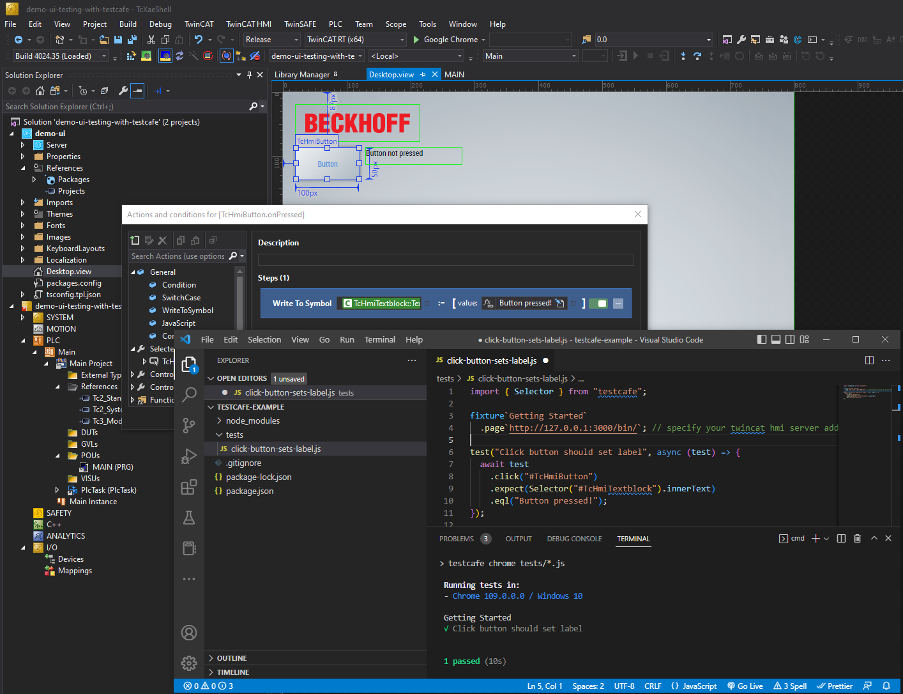

# Simple example of running UI testing with TestCafe and TwinCAT HMI

## Disclaimer

This is a personal guide not a peer reviewed journal or a sponsored publication. We make
no representations as to accuracy, completeness, correctness, suitability, or validity of any
information and will not be liable for any errors, omissions, or delays in this information or any
losses injuries, or damages arising from its display or use. All information is provided on an as
is basis. It is the reader’s responsibility to verify their own facts.

The views and opinions expressed in this guide are those of the authors and do not
necessarily reflect the official policy or position of any other agency, organization, employer or
company. Assumptions made in the analysis are not reflective of the position of any entity
other than the author(s) and, since we are critically thinking human beings, these views are
always subject to change, revision, and rethinking at any time. Please do not hold us to them
in perpetuity.

## Overview

This is a small example of running a test with [TestCafe](https://testcafe.io/) and TwinCAT HMI.

## Getting started

You must have node.js installed on your system

1. Clone the repo
2. Open the command prompt to .\src\testcafe-example\ and type `npm install`
3. Open the TwinCAT HMI project and start it in live view
4. Copy the URL and paste this in to the .\src\testcafe-example\tests\click-button-sets-label.js

```js
fixture`Getting Started`.page`{{paste your URL here}}`;
```

5. To run the test, open the command prompt to .\src\testcafe-example\ and type `npm run test`

## Expanding the example

The test included will check that upon clicking the button "TcHmiButton" the label "TcHmiTextblock" is correctly updated to show the text "Button pressed!"

You can place as many tests in the test folder as you like. They will all be called in sequence.

## Screenshot



## Versions

- TcXaeShell 3.1.4024.35
- TwinCAT HMI 1.12.758.8
- Chrome
- Node 16.17.0

## Need more help?

Please visit http://beckhoff.com/ for further guides
